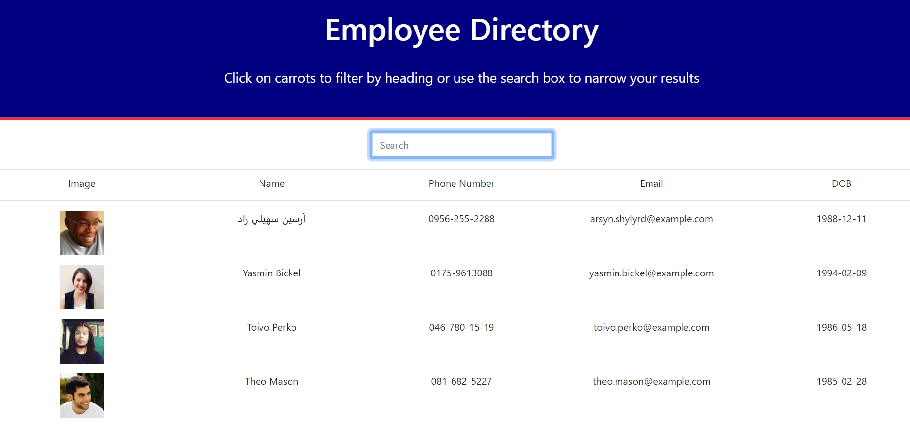

:part_alternation_mark:

    
# Employee Database   -- React App
---

>Link to github repository https://github.com/MT2314/Employee-Directory
#### Deployed App Link
https://mt2314.github.io/Employee-Directory/

https://employee-database--system.herokuapp.com/
    

    
## Description
---
##### Progressive Budget Tracking Application
 

> Built using React 
> Seeding Data with Web Api to be used as props to display data
> Seemless Search and Sort Database
    
 

##Table of Contents
---
[Technologies Used](#technologies)
[Usage](#usage-guide)
[License](#license)
[Contributing](#contributing)

### Technologies
HTML , CSS , Javascript , React

### Usage Guide

#####Follow Steps
* Navigate to website (either link)

--- Github Pages
https://mt2314.github.io/Employee-Directory/

--- Heroku
https://employee-database--system.herokuapp.com/

* Scroll down the list to see Employees
* Click on headers to sort order of employees
* Search by employee name 
  

### Contributing
---
> :school: 
**University of Toronto Continuing Educationg
Full Stack Flex Program** 
:school:

:heart: 
*Students and Instructors At the UFT-FSF-2020-2021*
:heart:

### License
---
Licensed under the MIT license.
 

 

:lock::lock::lock::lock:
